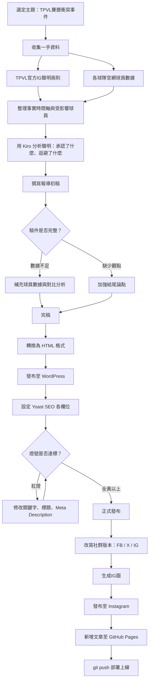

# 期末作業說明文件

**姓名**：林佳妤
**主題**：TPVL元年賽曆衝突事件報導
**發布網址**：[https://cocorico.info/blog/2026/06/08/tpvl-schedule-conflict-volleyball/]
[https://a113010005-prog.github.io/blog/tpvl-schedule-conflict/]
---

## 一、為什麼選這個主題

我本來就有在追台灣職業排球聯賽（TPVL），元年賽季從開打就一路看到季後賽。當聯盟發出聲明，說明因為 FIVB 召回規定導致八名主力無法出賽季後賽，我覺得這個問題值得被更多人關注。

這不只是「運氣不好」的問題，而是制度設計的失誤——球員沒有做錯任何事，卻在最重要的舞台缺席。身為新聞系學生，我希望透過這篇報導，讓更多球迷了解事件始末，也希望引起對 TPVL 聯盟的關注，促使官方在第二季做出改善，不要再剝奪球員應有的參賽權益。

---

## 二、使用工具

| 工具 | 用途 |
|------|------|
| Kiro | 整理事實資料、撰寫與編輯報導 |
| ChatGPT | 輔助分析官方聲明、查核資訊 |
| WordPress（cocorico.info） | 發布報導、SEO 設定 |
| Yoast SEO | 優化文章的搜尋引擎可見度 |
| 台中連莊、台鋼天鷹官網 | 查詢球員本季數據 |
| TPVL 官方 Instagram | 取得官方聲明原文 |

---

## 三、工作流程圖

---

## 四、每個步驟做了什麼

**步驟一：選題與資料收集**
從 TPVL 官方 Instagram 取得兩則官方聲明原文（2026.05.20、2026.05.21），整理受影響的八名球員名單及其國籍與位置。

**步驟二：事實整理**
建立 `TPVL事實整理.md`，記錄事件時間軸、球員資料、聲明重點摘要，標注待確認的資訊並逐一補齊。

**步驟三：聲明分析**
用 Kiro 分析兩則聲明，找出聯盟承認的、說得模糊的、完全沒回答的三個層次，作為報導的批判性觀點來源。

**步驟四：數據查核**
根據 ChatGPT 建議，從台中連莊（winstreak-volleyball.com）及台鋼天鷹（skyhawks-volleyball.com）官網抓取本季球員數據，用具體數字說明缺陣的戰力損失。

**步驟五：撰寫報導**
依照新聞深度報導架構撰寫，包含：事件還原、背景說明、數據對比、聲明分析、結論與展望，共約900字。

**步驟六：發布與 SEO 設定**
將報導轉換為 HTML 格式，透過 WordPress 程式碼編輯器貼入，並設定 Yoast SEO 的焦點關鍵字、SEO 標題、Slug、Meta Description，調整至燈號達標後正式發布。

**步驟七：社群媒體發布**
將報導改寫為三個社群版本（Facebook、X/Twitter、Instagram），調整篇幅與口氣，並發布至 Instagram。

---

## 五、遇到的困難

**困難一：Yoast SEO 燈號**
中文關鍵字的偵測不如英文準確，Yoast 對「TPVL賽曆衝突」的辨識一直出現問題，嘗試多次修改後，但因為已經是黃燈，且上網查資料發現經常有燈號錯誤的問題，所以繼續用此關鍵字。

**困難二：Markdown 與 WordPress 的格式轉換**
直接貼 Markdown 文字到 WordPress，`##` 標題和段落格式無法被正確辨識，Yoast 讀到的字數只有27字。最後改用 HTML 格式透過程式碼編輯器貼入也沒有解決。

---

## 六、成果

- 報導發布於 cocorico.info
- Instagram 發布：https://www.instagram.com/p/DZWKbZfSMII/
- SEO 分析：尚可；可讀性分析：良好
- 資料來源透明，附有外部連結至官方聲明及數據頁面
