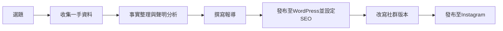

# 期末專題需求文件

---

## 基本資訊

- **主題：** TPVL元年賽曆衝突事件報導
- **姓名：** 林佳妤
- **組員：** 無

---

## 你的 Pipeline

---

## 每個步驟的決策

| 步驟 | 工具 | 誰做（你/AI） | 輸入 | 輸出 |
|------|------|-------------|------|------|
| 選題 | — | 我 | 對TPVL的關注與事件觀察 | 確定主題：賽曆衝突 |
| 收集一手資料 | Instagram、球隊官網 | 我 | TPVL官方聲明、球員數據頁面 | 原始資料 |
| 事實整理與聲明分析 | Kiro | AI輔助 | 官方聲明原文 | TPVL事實整理.md |
| 撰寫報導 | Kiro | AI輔助，我判斷與修改 | 事實整理、數據 | TPVL報導.md |
| 發布與SEO設定 | WordPress、Yoast SEO | 我 | 報導HTML版本 | 已發布文章 |
| 改寫社群版本 | Kiro、ChatGPT | AI輔助，我修改 | 報導本文 | 社群版本.md |
| 發布至Instagram | Instagram | 我 | IG caption | 已發布貼文 |

---

## 你的判斷

1. **為什麼選這個主題？**

（請填寫）

2. **哪個步驟你最有把握？為什麼？**

（請填寫）

3. **哪個步驟你最不確定？為什麼？**

（請填寫）

4. **你的成本估算？**

（請填寫）
