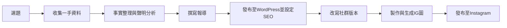

# 期末專題需求文件

---

## 基本資訊

- **主題：** TPVL元年賽曆衝突事件報導
- **姓名：** 林佳妤
- **組員：** 無

---

## 你的 Pipeline

---

## 每個步驟的決策

| 步驟 | 工具 | 誰做（你/AI） | 輸入 | 輸出 |
|------|------|-------------|------|------|
| 選題 | — | 我 | 對TPVL的關注與事件觀察 | 確定主題：賽曆衝突 |
| 收集一手資料 | Instagram、球隊官網 | 我 | TPVL官方聲明、球員數據頁面 | 原始資料 |
| 事實整理與聲明分析 | Kiro | AI輔助 | 官方聲明原文 | TPVL事實整理.md |
| 撰寫報導 | Kiro | AI輔助，我判斷與修改 | 事實整理、數據 | TPVL報導.md |
| 發布與SEO設定 | WordPress、Yoast SEO | 我 | 報導HTML版本 | 已發布文章 |
| 改寫社群版本 | Kiro、ChatGPT | AI輔助，我修改 | 報導本文 | 社群版本.md |
| 發布至Instagram | Instagram | 我 | IG caption | 已發布貼文 |

---

## 你的判斷

1. **為什麼選這個主題？**
我本來就有在追台灣職業排球聯賽（TPVL），元年賽季從開打就一路看到季後賽。當聯盟發出聲明，說明因為 FIVB 召回規定導致八名主力無法出賽季後賽，我覺得這個問題值得被更多人關注。

這不只是「運氣不好」的問題，而是制度設計的失誤——球員沒有做錯任何事，卻在最重要的舞台缺席。身為新聞系學生，我希望透過這篇報導，讓更多球迷了解事件始末，也希望引起對 TPVL 聯盟的關注，促使官方在第二季做出改善，不要再剝奪球員應有的參賽權益。

2. **哪個步驟你最有把握？為什麼？**
撰寫新聞稿，因為我有自己的一手資料，還有AI可以輔助我確保資料來源的正確率。而且寫完新聞稿後，我可以用AI幫我改錯和修正，修改完我再確認一次新聞稿就完成了，要什麼結構或要什麼內容，我都可以用AI來輔助我。

3. **哪個步驟你最不確定？為什麼？**
SEO設定是我最不確定的，因為當我問AI如何修正時，雖然AI都會告訴我修正方法，把燈號變成黃燈或綠燈，但當我修改完，燈號卻沒變，我會懷疑到底是我沒有改好，還是SEO設定的判別錯誤。

4. **你的成本估算？**
我使用了Kiro一個帳號一個月的額度，主要是問他，該怎麼做，以及幫我整理資料。時間成本約2天，理解如何操作及實踐。金錢成本，0元。