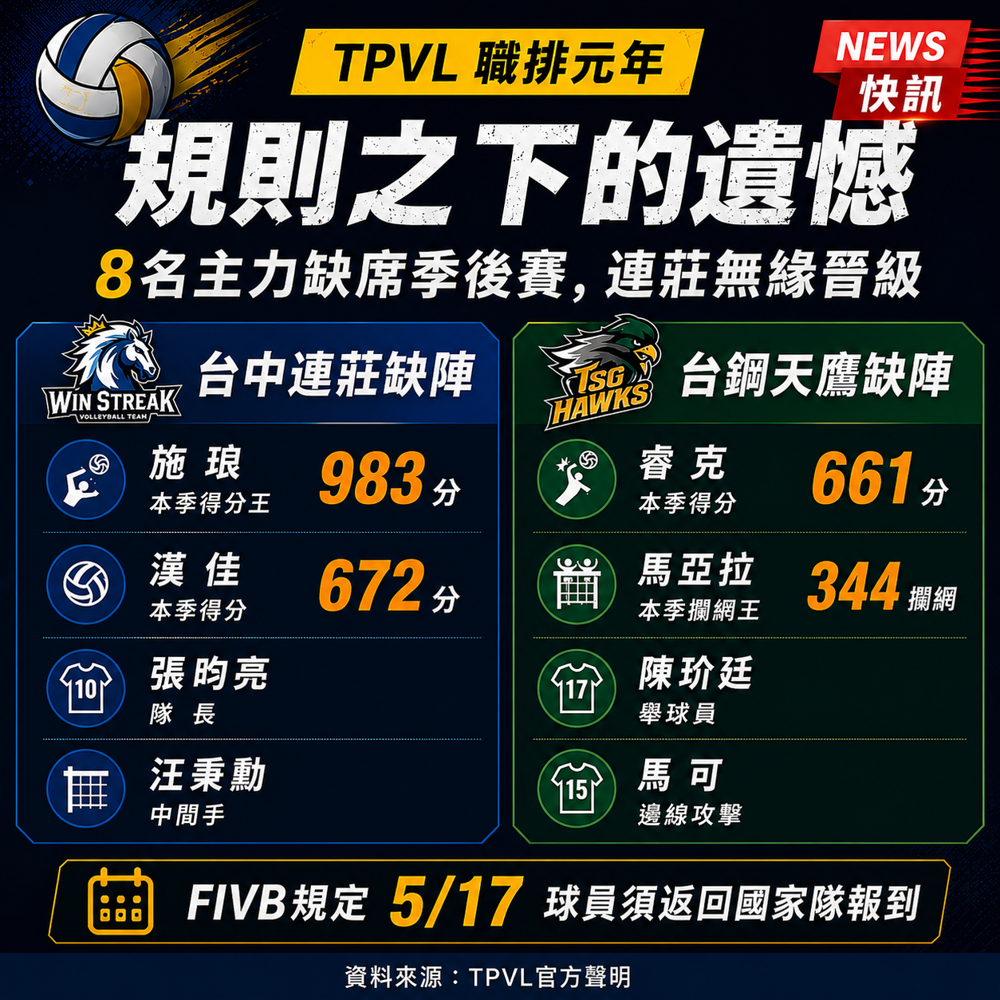

# 社群版本

---

## Facebook 版

【職排元年，最讓人心疼的一幕】

連莊輸掉季後賽的那一天，球迷等來的不是逆轉奇蹟，而是一份缺席名單。

5月25日，台中連莊敗給雲豹，無緣晉級。但在那之前，隊長張昀亮、中間手汪秉勳，以及兩名主力攻擊手施琅、漢佳，早已於5月17日依照 FIVB 規定返回各自國家隊報到。他們不是受傷，也不是停賽，而是在職業聯賽最重要的舞台，被迫缺席。

本季得分王施琅累積983分、攻擊成功率48.9%；漢佳攻下672分、成功率43.9%。兩人撐起連莊大半進攻火力，卻無法陪球隊走完最後一段路。

同樣有4名球員離隊的台鋼天鷹，最終成功奪冠；反觀連莊，甚至必須讓舉球員補上攻擊位置，結果可想而知。

TPVL 賽後坦承賽程規劃未能完整確認國際賽曆。這不是球員的錯，也不只是球隊的問題，而是制度設計留下的缺口。

代表國家出賽是一種榮耀，但球員不該因此錯過職業生涯最重要的比賽。希望第二季，這樣的遺憾不要再重演。

完整報導👇
https://cocorico.info/blog/2026/06/08/tpvl-schedule-conflict-volleyball/

#TPVL #台灣職業排球聯賽 #職排元年 #台中連莊 #台鋼天鷹 #排球 #FIVB #季後賽

---

## X / Twitter 版

職排元年最大的遺憾，或許不是輸球。而是在最重要的季後賽，有些球員根本沒有機會站上場。

連莊4名主力——得分王施琅（983分）、漢佳（672分）、隊長張昀亮與汪秉勳，早在5月17日就依 FIVB 規定離隊，返回國家隊報到。

同樣缺少4人的天鷹最終奪冠；連莊卻得讓舉球員補上攻擊位置，最終敗給雲豹出局。

TPVL 已公開道歉，坦承申請展延賽程時未同步確認國際賽曆。

代表國家出賽是榮耀，但不該與職業聯賽的季後賽二選一。職排元年的學費，球員和球迷一起付了。

完整報導 → https://cocorico.info/blog/2026/06/08/tpvl-schedule-conflict-volleyball/

#TPVL #職排元年 #台中連莊 #台灣排球

---

## Instagram Caption

🏐 職排元年最令人遺憾的一幕。

連莊季後賽缺席4名主力，不是因為受傷，也不是因為停賽，而是因為他們必須回國家隊報到。得分王施琅、漢佳、張昀亮、汪秉勳，就這樣錯過了職業生涯最重要的舞台之一。

聯盟道歉了，但結果無法重來。第二季，請別讓同樣的故事再次發生。

#TPVL #台灣職業排球聯賽 #職排元年 #台中連莊 #台鋼天鷹
